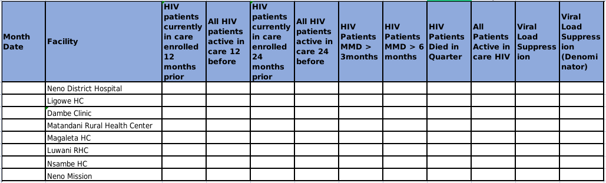

# Mysql Query Automation
This is a tool that automates the execution of mysql database queries.

Let's take a look at this report:

Each column in the report has an SQL query that I need to run and for each query I have to be chaning the facility name. That means to fill the `All Patients Active in care HIV` column, I have the run that query 8 times. Actually more than 8 times becase there's a list of 6 more facilities that are not there. This is tedious!

The solution is to automate the execution of these queries.

